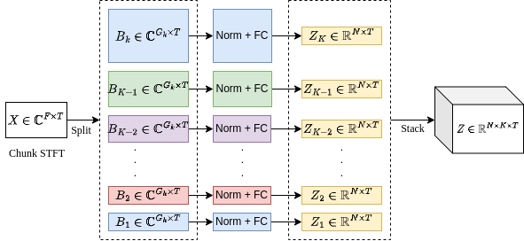
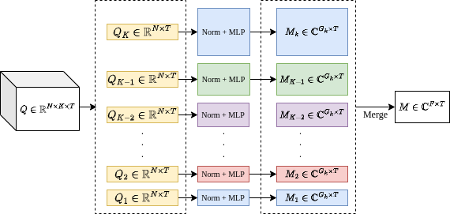
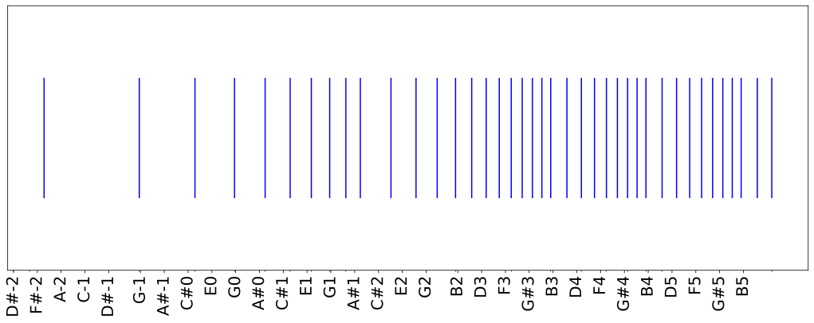
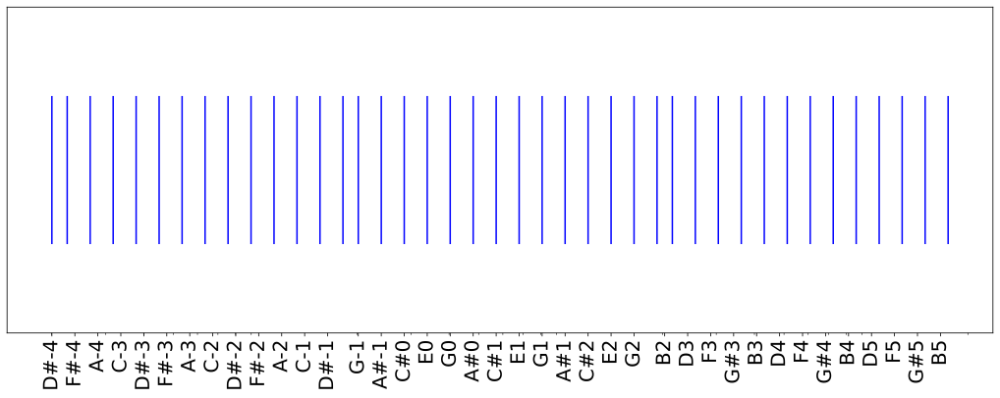
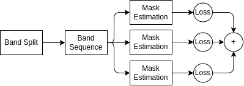
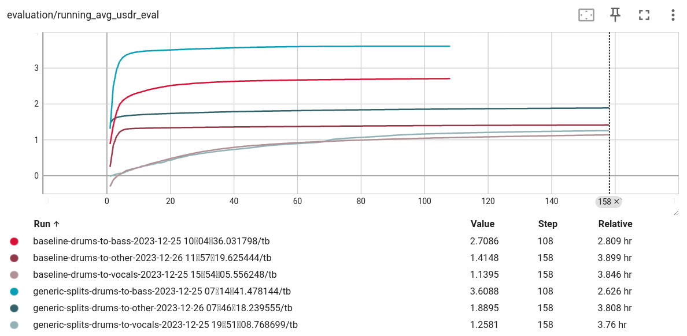

# Refined Band-Split RNN

This repository contains implementation of [BSRNN](https://arxiv.org/abs/2209.15174) Architecture and
[Refined BSRNN](./docs/report.pdf).

## Table of Content

- [1 Review of BSRNN](#1review-of-bsrnn)
    - [1.1 Pre-processing and Post-processing Steps](#11-pre-processing-and-post-processing-steps)
    - [1.2 Band Split Module](#12-band-split-module)
    - [1.3 Band and Sequence Modeling Module](#13-band-and-sequence-modeling-module)
    - [1.4 Mask Estimation Module](#14-mask-estimation-module)
- [2 Refined BSRNN](#2-refined-bsrnn)
    - [2.1 Universal sub-bands](#21-universal-sub-bands)
    - [2.2 Multi-task learning](#22-multi-task-learning)
- [3 Implementation](#3-implementation)
    - [3.1 Getting started](#31-getting-started)
    - [3.2 Project structure](#32-project-structure)
- [4. Results](#4-results)

## 1 Review of BSRNN

BSRNN is structured around a series of distinct modules designed for effective MSS. These include the Band Split module, the Band and Sequence Modeling module, and the Mask Estimation module. Additionally, the framework incorporates pre-processing and post-processing steps for optimal input and output handling.

### 1.1 Pre-processing and Post-processing Steps
In the pre-processing step, audio is loaded, normalized, and split into equal-sized chunks. Each chunk undergoes the Short-Time Fourier Transform (STFT) to convert it into the frequency domain for input into the BSRNN model.
The post-processing reverses this process, converting frequency domain data back into audio signals. While the original BSRNN paper did not specify the normalization technique, we apply root mean square (RMS) and peak normalization to the entire waveform and standardization to each STFT chunk.

### 1.2 Band Split Module



The Band Split Module divides a complex spectrogram, into $K$ frequency subbands. They approach the conversion of complex numbers by treating their real and imaginary parts as distinct channels. Each subband is normalized and transformed through a layer normalization and a fully-connected layer, creating $K$ separate real-valued subband features. These features are then combined into a single fullband feature tensor, preserving the unique normalization and transformation applied to each subband.

In the Band Split section, it's noted that the original paper outlines several band split schemas tailored for different instruments. These schemas vary the inputs and the number of outputs in this layer, consequently altering the architecture. Among these, the v7 schema is highlighted as the closest to optimal and most performant, as per the original authors. In [Refined BSRNN](#2-refined-bsrnn), we will delve deeper into this module and propose our own schema. This proposed schema aims to develop a generic Band Split module, adaptable for any instrument.


### 1.3 Band and Sequence Modeling Module


The Band and Sequence Modeling Module interleaves processing at two levels: sequence and band. It uses two types of RNN layers designed to handle the temporal sequence and the frequency bands of the input. The sequence-level RNN deals with the temporal aspect, applying the same process to each frequency subband because they share the same dimensions. This design allows for simultaneous processing of all subbands, making the model more efficient.

At the band level, the RNN focuses on the relationships within each frequency band across all subbands, capturing the detailed features necessary for effective separation. The design of both RNNs includes a normalization step, followed by a BLSTM layer for capturing patterns in both forward and backward time sequences, and a fully connected layer for the actual modeling work. Residual connections help the network learn more effectively by linking the input and output of the modeling layers.

By stacking multiple RNN layers, the model's depth and complexity increase, which can lead to better performance.

### 1.4 Mask Estimation Module



The Mask Estimation Module is responsible for creating complex-valued time-frequency (T-F) masks that are used to isolate the target source from the mixture. The process starts with the $Q$, which contains $K$ separate features for each sub-band. These features have been processed by the previous modules and are now ready for mask creation.

Each of the $K$ sub-band features undergoes normalization and then passes through a Multilayer Perceptron (MLP) with a single hidden layer. The MLP's job is to produce the real and imaginary parts of the T-F masks. These masks, denoted as $M_i$, are what allow the model to differentiate and extract the desired source from the complex audio mixture.

This approach of using an MLP for mask estimation is based on findings from [@liUseDeepMask2022](./docs/refs.bib), which suggest that MLPs can more accurately estimate T-F masks compared to simpler fully connected (FC) layers. 

Like in the Band Split Module, each subband feature in the Mask Estimation Module is treated with its own normalization and MLP. The resulting masks from all sub-bands are then combined into a fullband T-F mask $M$. This full-band mask is applied to the mixed spectrogram $X$ to yield the separated target spectrogram $S$, the final output representing the isolated audio source. 

## 2 Refined BSRNN

The pursuit of a more generalized and effective Music Source Separation model leads us to propose refinements to the BSRNN framework. These refinements are aimed at developing a universal feature extractor that can be applied to various musical instruments and contexts. In this section, we will detail the methodology for creating such a universal feature extractor and discuss its integration within the Band Split module. Furthermore, we will outline a multi-task learning approach that enables the training of this feature extractor to function universally.

### 2.1 Universal sub-bands

In reevaluating the BSRNN architecture, the use of expert knowledge for defining frequency band ranges tailored to specific instruments is a central theme. However, we posit that the schemas provided by the original author for these bands may not adequately capture the task-specific requirements.



In figure above where we have plotted the band ranges against musical notes, it becomes evident that the distribution of these ranges is uneven—some bands encompass entire octaves, while others cover only a single note.

This visualization suggests that the original author may have prioritized certain frequency ranges based on the presumption that they hold more significance, possibly due to the presence of the fundamental frequencies of the targeted instrument. Nonetheless, a harmonically rich sound is characterized not only by its fundamental frequency but by a spectrum of overtones that contribute to its timbre. Recognizing this, our critique is that the band distribution in the original BSRNN model does not fully represent the harmonic complexity of musical sounds.

To effectively address the limitations of the band range definitions in the original BSRNN architecture, it's essential to consider the harmonic structure of musical timbre. An instrument's timbre is composed of its fundamental frequency alongside a series of overtones. These overtones are integral to the sound's character and can be expressed mathematically as a series of frequencies, which are multiples of the fundamental frequency. The formula representing this overtone series is: $f_n = n \cdot f_0$ where $f_n$ is the frequency of the nth overtone and $f_0$ is the fundamental frequency.

Furthermore, it is crucial to recognize that the human perception of musical notes is logarithmic rather than linear. Thus, the linear band splits proposed by the original author may not effectively capture the perceived harmony within music. To devise a set of generic band splits that account for human auditory perception, we propose leveraging the twelve-tone equal temperament (12-TET) system, which is the foundation of most contemporary music. This system divides an octave into 12 equal parts, where each semitone interval is the twelfth root of two apart in frequency. [@Müller](./docs/refs.bib)

Building upon the 12-TET system, we can define band splits that delve into the microtonal realm, specifically the 24-TET system, which further splits each semitone into two. Placing the center of a fundamental frequency within a microtonal band allows us to align with the perceptual characteristics of human hearing more closely. This microtonal approach is particularly relevant as trained musicians and listeners can discern pitch variations as small as 10 cents on average. By employing microtonal band splits, our refined BSRNN can better accommodate the harmonic nuances of music, facilitating a more accurate and harmonically-aware source separation, even within the 12-TET framework.

To implement the evenly distributed microtonal band-splitting method, we employ an algorithm that calculates the frequencies for microtonal notes within the range of human hearing. This algorithm is based on a division of each octave into an equal number of microtones, as defined by the `divisions` parameter. Implementation is available in [bsrnn.py](./bsrnn.py) file. The result:



As we can see applying this algorithm, figure above illustrates that the splits are more uniformly distributed across the musical note spectrum.

### 2.2 Multi-task learning

In the context of a universal architecture for Music Source Separation, simply having a versatile structure is insufficient. It's equally important to have an effective training methodology that can fully exploit this architecture's capabilities. Multi-task learning offers a powerful approach to achieve this goal. By training the model on multiple source separation tasks concurrently, the model learns to generate several masks for different sources simultaneously.

The strength of MTL lies in its ability to integrate learning from various tasks, each contributing to a more comprehensive understanding within the model. For our refined BSRNN, we implement MTL by defining a cumulative loss function that aggregates the individual losses from each source separation task. These losses are calculated using the original loss function as defined in the BSRNN paper, which is applied to each task separately.

The cumulative loss function for the MTL framework, $L_{MTL}$, which is used to train the universal feature extractor, is defined as the sum of individual task losses. For each source separation task $j$, we calculate a loss function $L_{obj}^j$. The loss function is the as the original paper. The MTL loss is then:

$L_{MTL} = \sum_j{L_{obj}^j}$




Upon completing the training process, the Mask Estimations Layer can be detached and replaced by a singular Mask Estimation layer. The Band Split and Band Sequence modules are then set to a non-trainable state, and transfer learning is applied to the model for a new source separation task.

## 3 Implementation

## 3.1 Getting started

**Requirements**:
- Dataset: [MUSDB18-HQ](https://zenodo.org/records/3338373)
- python3 + [`requirements.txt`](./src/requirements.txt)


```shell
git clone https://github.com/sahandevs/BandSplit-RNN.git
cd ./BandSplit-RNN/src

python3 bsrnn.py --help
```

```
usage: bsrnn [-h] [--device DEVICE] [--seed SEED] {train,infer} ...

positional arguments:
  {train,infer}    commands
    train          train mode
    infer          infer mode

options:
  -h, --help       show this help message and exit
  --device DEVICE  torch.device
  --seed SEED      seed random generators. set -1 for random
```

**train:**

```
usage: bsrnn train [-h] [--sample_rate SAMPLE_RATE] [--generic_bands GENERIC_BANDS] [--chunk_size_in_seconds CHUNK_SIZE_IN_SECONDS]
                   [--n_fft N_FFT] [--feature_dim FEATURE_DIM] [--num_blstm_layers NUM_BLSTM_LAYERS] [--mlp_dim MLP_DIM]
                   [--batch_size BATCH_SIZE] [--reduce_size REDUCE_SIZE] [--part PARTS] [--portion PORTION]
                   [--clip_grad_norm CLIP_GRAD_NORM] [--max_epochs MAX_EPOCHS] [--lr LR] [--data_loader_workers DATA_LOADER_WORKERS]
                   --musdbhq_location MUSDBHQ_LOCATION [--checkpoint_fp CHECKPOINT_FP] --name NAME

options:
  -h, --help            show this help message and exit
  --sample_rate SAMPLE_RATE
                        Transform every audio to this sample rate
  --generic_bands GENERIC_BANDS
                        Use generic band schema (refined BSRNN)
  --chunk_size_in_seconds CHUNK_SIZE_IN_SECONDS
                        split waveform into x second chunks
  --n_fft N_FFT         STFT's n_fft param
  --feature_dim FEATURE_DIM
                        size of band-split module feature dim
  --num_blstm_layers NUM_BLSTM_LAYERS
                        number of stacked RNNs in BandSequence module
  --mlp_dim MLP_DIM     number of MaskEstimation module feature dim
  --batch_size BATCH_SIZE
                        NOTE: batch size is not songs but chunks in a single song
  --reduce_size REDUCE_SIZE
                        apply tricks to reduce model size (for experimenting only)
  --part PARTS          which part to train on (not MTL)
  --portion PORTION     percentage (0.0 to 1.0) of dataset to use. Useful for experimenting with smaller dataset
  --clip_grad_norm CLIP_GRAD_NORM
  --max_epochs MAX_EPOCHS
  --lr LR               learning rate
  --data_loader_workers DATA_LOADER_WORKERS
  --musdbhq_location MUSDBHQ_LOCATION
                        location of downloaded dataset (location of the root folder. the root folder should contain two sub-folders named
                        'train' and 'test')
  --checkpoint_fp CHECKPOINT_FP
                        location of checkpoint file (.pt)
  --name NAME           unique name for run name
```

**infer:**

```
usage: bsrnn infer [-h] --checkpoint_fp CHECKPOINT_FP --input INPUT --out OUT

options:
  -h, --help            show this help message and exit
  --checkpoint_fp CHECKPOINT_FP
                        location of checkpoint file (.pt)
  --input INPUT         model input audio file
  --out OUT             directory to output source(s)
```

## 3.2 Project structure

- [`./assets`](./assets/): Images and wav files for this file
- [`./docs`](./docs/): Diagrams and the reports
- [`./src`](./src/): Implementation directory
  - [`./src/bsrnn.py`](./src/bsrnn.py): CLI entrypoint
  - [`./src/infer.py`](./src/infer.py): Inference code
  - [`./src/train.py`](./src/train.py): Train code
  - [`./src/model.py`](./src/model.py): Model definition
  - [`./src/utils.py`](./src/utils.py): Utility functions
  - [`./src/visualize.ipynb`](./src/visualize.ipynb): Model scratchpad and experiments notebook

## 4 Results

- **[TinyBaseModel] Comparison between generic splits vs v7 schema for transfer learning:**

In this experiment, we trained two base models with v7 schema (original paper) and generic splits schema (our method) for drums, then applied transfer learning for other sources (vocals, bass andd other). Following figure shows the uSDR score of the resulting models. (shades of red -> baseline (v7 schema), shades of blue -> generic splits)

Hardware:
- 3070 | 32GB Ram | i5 12th
- base models: ~30hr
- transferred models: ~2.5hr



We did see improvements on drums to (bass and other) but not in vocals. To ensure the results are consistent we should train a larger model. The base models are significantly smaller in comparison of the original paper suggested model size.

Input song (out of dataset): [NUCLEAR KITTENS!!!! // Pomplamoose
](https://www.youtube.com/watch?v=HP8La1yBDrw)

|Model name|Output|Checkpoint Download|
|--- |--- |--- |
|Baseline drums|[.wav](./assets/v7-baseline-drums.wav)|[Google Drive](https://drive.google.com/drive/folders/19wf1OYnhJAy7SDDGfkL8py9mPFcSI30r?usp=sharing)|
|Generic splits drums|[.wav](./assets/generic-splits.drums.wav)|[Google Drive](https://drive.google.com/drive/folders/19wf1OYnhJAy7SDDGfkL8py9mPFcSI30r?usp=sharing)|
|Baseline drums to bass|[.wav](./assets/v7-baselin-drums-to-bass.wav)|[Google Drive](https://drive.google.com/drive/folders/19wf1OYnhJAy7SDDGfkL8py9mPFcSI30r?usp=sharing)|
|Generic splits drums to bass|[.wav](./assets/generic-splits-drums-to-bass.wav)|[Google Drive](https://drive.google.com/drive/folders/19wf1OYnhJAy7SDDGfkL8py9mPFcSI30r?usp=sharing)|
|Baseline drums to other|[.wav](./assets/v7-baseline-drums-to-other.wav)|[Google Drive](https://drive.google.com/drive/folders/19wf1OYnhJAy7SDDGfkL8py9mPFcSI30r?usp=sharing)|
|Generic splits drums to other|[.wav](./assets/generic-splits-drums-to-othere.wav)|[Google Drive](https://drive.google.com/drive/folders/19wf1OYnhJAy7SDDGfkL8py9mPFcSI30r?usp=sharing)|
|Baseline drums to vocals|[.wav](./assets/v7-baseline-drums-to-vocals.wav)|[Google Drive](https://drive.google.com/drive/folders/19wf1OYnhJAy7SDDGfkL8py9mPFcSI30r?usp=sharing)|
|Generic splits drums to vocals|[.wav](./assets/generic-splits-drums-to-vocals.wav)|[Google Drive](https://drive.google.com/drive/folders/19wf1OYnhJAy7SDDGfkL8py9mPFcSI30r?usp=sharing)|

- **[LargeBaseModel] Comparison between generic splits vs v7 schema for transfer learning:**

N/A

- **[MTL] Use multi-task learning**

N/A